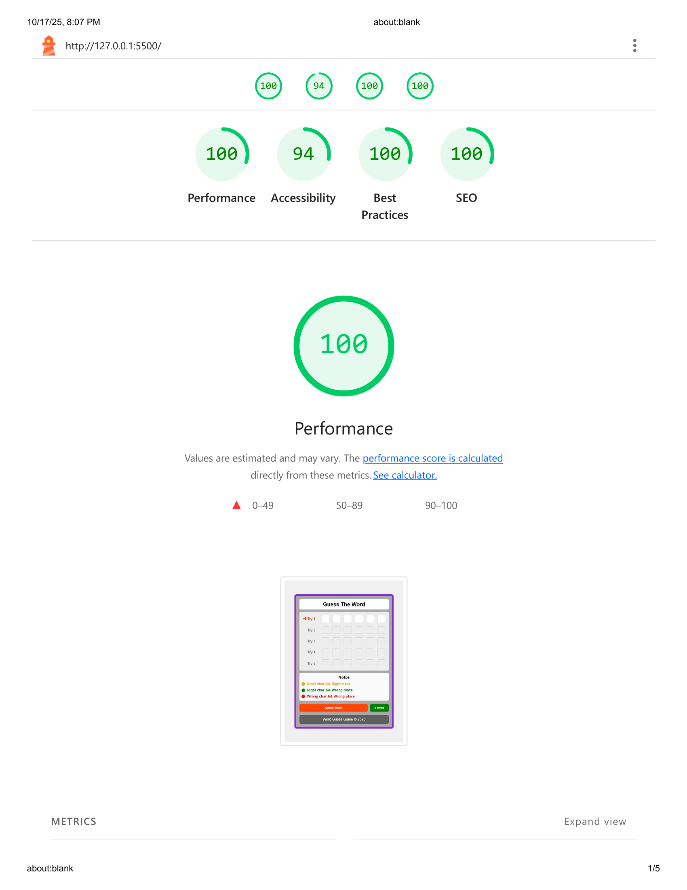
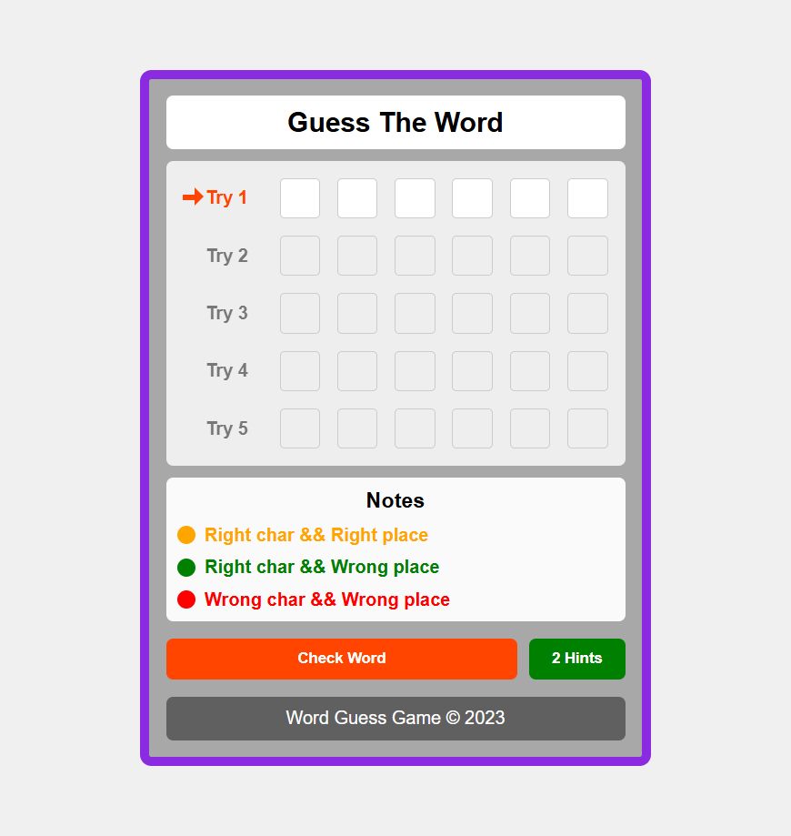

🎮 Guess Game

A fun and interactive Word Guessing Game built with HTML, CSS, and JavaScript.
The goal is to guess a randomly generated 6-letter word within a limited number of tries.
Each guess gives you color feedback to help you find the correct word — just like Wordle! 

---

🚀 Live Demo

👉 [https://github.com/ahmednabil22224/guess-game](https://ahmednabil22224.github.io/guess-game/)

---

🧠 Features

🔤 Random Word Generation — Every round generates a unique 6-letter word.

🎯 5 Tries Limit — Challenge yourself to guess before attempts run out.

🧩 Color Feedback System:

🟧 Orange → Correct letter, correct position

🟩 Green → Correct letter, wrong position

🟥 Red → Letter not in the word

💡 Hints System — Reveal up to 2 letters per game.

⌨️ Keyboard Navigation — Use arrow keys and backspace smoothly between inputs.

🔁 Restart Anytime — Play again instantly after a win or loss.

---

🛠️ Built With

HTML5 — Structure and layout

CSS3 — Styling and animations

JavaScript (ES6) — Game logic and interactivity

```
📁 Folder Structure
guess-game/
│
├── index.html
├── css/
│ └── style.css
├── images/
│ └── ...
│ ├── guess-game.png
│ └── lighthouse-report.png
└── README.md
```

---

⚙️ Installation & Setup

Clone this repository

git clone https://github.com/ahmednabil22224/guess-game.git

Open the folder

cd guess-game

Run the game

Open index.html in your browser

No server setup required 🚀

---

🧩 Lighthouse Performance
Category Score
Performance 100%
Accessibility 94%
Best Practices 100%
SEO 100%

images/lighthouse-report.png

## ⚡ Lighthouse Report



## 📸 Preview


